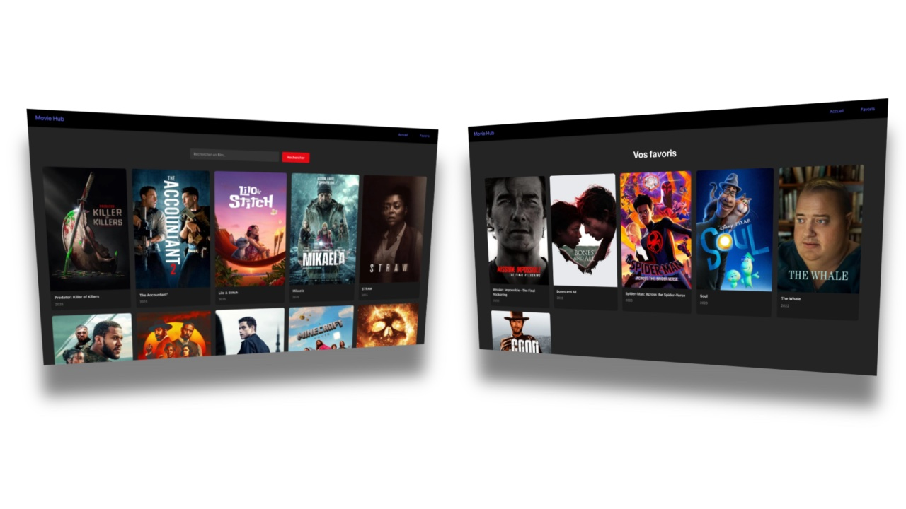

# 🎯 MovieHUB

MovieHUB est une application web React qui permet de rechercher et de consulter les films les plus populaires du moment.
Ce projet m’a permis de découvrir les bases de React en pratiquant sur une interface complète, responsive et connectée à l’API TMDB.
Il s'agit d’un projet d’apprentissage réalisé à partir d’un tutoriel de [Tech With Tim](https://www.youtube.com/watch?v=G6D9cBaLViA).

## 📸 Aperçu

> Aperçu de l’interface de l’application, avec un visuel du hub des films les plus populaires, ainsi que de la page des favoris.



## 🚀 Fonctionnalités

- ✅ Rechercher des films via la barre de recherche (requêtes [TMDB](https://developer.themoviedb.org/docs/getting-started) en temps réel)
- ✅ Afficher les films populaires et leurs informations (titre, image, date)
- ✅ Ajouter / retirer un film des favoris
- ✅ Accéder à la liste des films favoris depuis une page dédiée

## 🛠️ Stack technique

- **Frontend** : React

## 🔧 Installation

```bash
# 1. Clone le repo
git clone https://github.com/florianLSP/react-moviehub.git

# 2. Installe les dépendances
npm install

# 3. Démarre le projet
npm run dev
```
